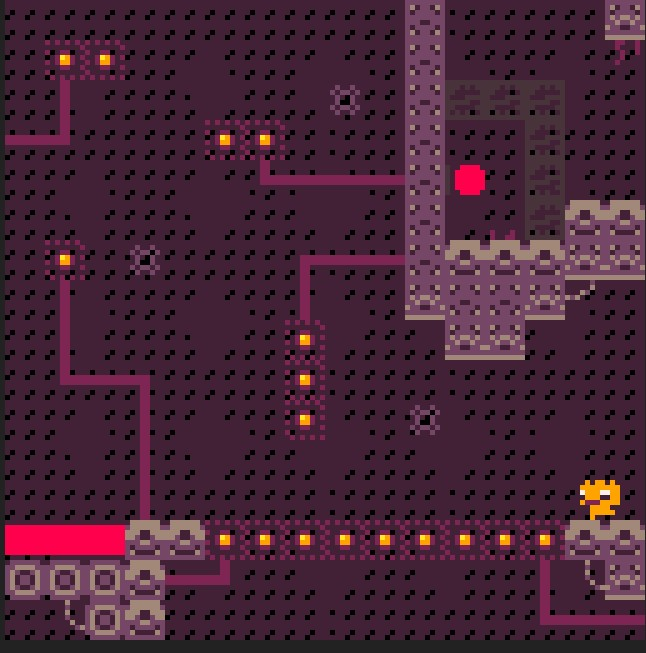

### developing games: the level design of "I Demand Coffee" by [@Elastiskalinjen](https://twitter.com/Elastiskalinjen)

theres this one part that really gets to me in [I Demand Coffee](https://elastiskalinjen.itch.io/i-demand-coffee). its the level that introduces one of the best mechanic in the game. its this level: 

the game has a uniqe mechanic to its name: a float button. holding down the "x" key while in the air will make you float, almost forever. however, the creator desided to add a more, lets just say, creative level. the level design is like this: you have to jump up to avoid the fall down but after falling, you deside to float your way up to the other side. but when you land on the weird patterns, you say "hey, i can walk on these."
.png "a title")

but heres the thing: the game #evloves.
this one part im talking about, is actually a variant of the timed blocks, which is a variant of another jump-on-a-button-and-it-works block.
this game is very creative.

please support the developer by buying this game[this game](https://elastiskalinjen.itch.io/i-demand-coffee)

<iframe src="https://discord.com/widget?id=966783947566616607&theme=dark" width="350" height="500" allowtransparency="true" frameborder="0" sandbox="allow-popups allow-popups-to-escape-sandbox allow-same-origin allow-scripts"></iframe>

